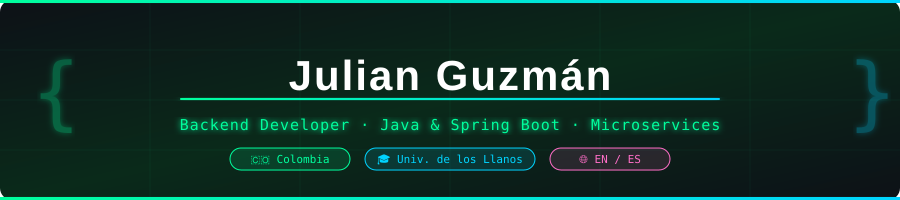

<!-- INSTRUCCIONES: 
  1. Crea el repo especial: github.com/new → nombre exacto "julianguzmantv" → Initialize with README
  2. Sube los 2 archivos SVG (header.svg y divider.svg) a ese mismo repo
  3. Pega este README.md → commit → ¡listo!
-->

<div align="center">



<br/>

<!-- BADGES SOCIALES -->
<a href="https://www.linkedin.com/in/julian-guzman-784126148">
  
</a>
&nbsp;
<a href="https://github.com/julianguzmantv?tab=repositories">
  
</a>
&nbsp;

&nbsp;


</div>

<br/>


## `$ whoami`

```java
@Engineer
public class JulianGuzman {

    final String name        = "Julian Guzmán";
    final String role        = "Backend Developer";
    final String university  = "Universidad de los Llanos";
    final String degree      = "Ingeniería de Sistemas";
    final String location    = "Colombia 🇨🇴";
    final String[] idiomas   = { "Español (Nativo)", "English (Bilingual)" };

    final String[] foco = {
        "APIs REST escalables con Java + Spring Boot",
        "Arquitecturas de Microservicios distribuidos",
        "Automatización y administración remota de sistemas",
        "Algoritmos de optimización e IA aplicada"
    };

    String misión() {
        return "Construir software que resuelva problemas reales. Limpio, eficiente y escalable.";
    }
}
```


## 🛠️ Stack Tecnológico

<div align="center">

**— Backend Core —**


**— Otros Lenguajes —**


**— Bases de Datos —**


**— DevOps & Herramientas —**


</div>


## 🚀 Proyectos Destacados

<div align="center">

| 🎯 Proyecto | 📝 Descripción | 🔧 Stack | 🔗 |
|:---|:---|:---|:---:|
| **[EventPRO](https://github.com/julianguzmantv/EventPRO)** | Gestor de eventos globales impulsado por IA. Búsqueda inteligente, filtrado avanzado y arquitectura Java full-stack. | `Java` `Spring Boot` `AI` | [](https://github.com/julianguzmantv/EventPRO) |
| **[RemoteAdmin IntraRed](https://github.com/julianguzmantv/Administraci-nRemotaIntraRed)** | Sistema de administración remota de PCs en red local. Backend Spring Boot + agente Electron multiplataforma. | `Spring Boot` `Electron` `WebSockets` | [](https://github.com/julianguzmantv/Administraci-nRemotaIntraRed) |
| **[PrimeMicroservicios](https://github.com/julianguzmantv/PrimeMicroservicios-GenPrimos)** | Arquitectura distribuida de microservicios para generación de primos de 12+ dígitos con procesamiento asíncrono. | `Java` `Microservices` `Async` | [](https://github.com/julianguzmantv/PrimeMicroservicios-GenPrimos) |
| **[RemoteConnection Linux↔Win](https://github.com/julianguzmantv/RemoteConnectionLinux-Windows)** | Puente de conexión remota entre Linux y Windows. Ligero y eficiente, escrito en Go para máxima performance. | `Go` `Networking` `Cross-platform` | [](https://github.com/julianguzmantv/RemoteConnectionLinux-Windows) |
| **[RutaOptimaPy](https://github.com/julianguzmantv/RutaOptimaPy)** | Sistema de resolución de problemas de optimización no lineal con métodos analíticos y algorítmicos. | `Python` `Algoritmos` `Math` | [](https://github.com/julianguzmantv/RutaOptimaPy) |
| **[Kit Macetas Modulares](https://github.com/julianguzmantv/kit-macetas-modulares)** | Kit modular de germinación con diseño paramétrico en Python para impresión 3D FDM. | `Python` `3D Printing` `Parametric` | [](https://github.com/julianguzmantv/kit-macetas-modulares) |

</div>


## 📊 GitHub Stats

<div align="center">


</div>

> ⚠️ **Nota:** Las tarjetas de stats requieren conexión a `vercel.app`. Si no cargan en tu red, prueba desde otra conexión o activa una VPN.


## 📈 Actividad de Contribuciones

<div align="center">

</div>


## 🎯 Estado Actual

```bash
$ juliandev --status

▸ Estudiando     Ingeniería de Sistemas @ Universidad de los Llanos
▸ Construyendo   APIs REST y microservicios con Java/Spring Boot
▸ Aprendiendo    Cloud (AWS/GCP) · Docker · CI/CD Pipelines
▸ Disponible     Proyectos remotos · Colaboraciones · Freelance
▸ Intereses      Backend Architecture · Distributed Systems · AI
```


## 📬 Hablemos

<div align="center">

<a href="https://www.linkedin.com/in/julian-guzman-784126148">
  
</a>
&nbsp;
<a href="https://github.com/julianguzmantv">
  
</a>

<br/><br/>

> *"Any fool can write code that a computer can understand.*
> *Good programmers write code that **humans** can understand."*
>
> — **Martin Fowler**

<br/>


</div>
